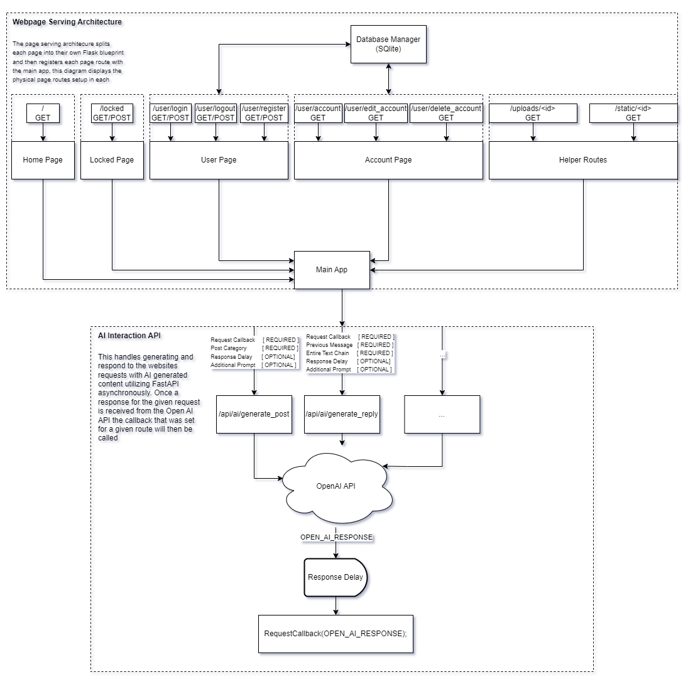

<p align="center">
	
	<br>
	<br>
	
	<br>
	<br>
Combatting phishing utilizing Large Language Models (LLMs) to remove the "victim" from the equation.
<hr>
</p>

### Why?
<br>
Our project attempts to investigate an innovative approach to combating internet scams and phishing. Phishing is an ever-growing attack vector that is costing companies hundreds of millions of dollars every year. In 2023 alone IC3 reported phishing losses over $18 million dollars, a significant amount among individuals and organizations. The current strategy regarding phishing prevention is detection software which relies on individual users to correctly identify and address threats. However, through Hyperspace forum we utilize AI chatbots to engage attackers directly wasting time and resources that would otherwise target vulnerable individuals. Organizations whether small or large would benefit from the implementation of counteractive AI which would potentially save tremendous resources. In essence, prolonging scammer interaction with AI chatbots on a honeypot platform highlights alternative methods organizations can utilize to combat a growing issue. 
<be>

### How?
This small-scale test is intended to serve as a preliminary test to determine the feasibility of this approach. This is being conducted by deploying a website that is disguised as a crypto forum (and is populated with bots). The forum's true purpose is to lure in potential threat actors and entice them to begin attempting to scam users on the forum (Crypto was chosen for its money-driven nature). At this point we (the site admins) can specifically choose to begin targeting the attacker this is done through two main steps. <br>
1. Eliminate the risk to possible real users of the forum by shadow banning the post from everyone's feed except for admins
2. Engage the attacker with the LLM this is done by the admin initiating a conversation with the user utilizing the LLM thus starting the back-and-forth between the two
<br>


### Technical Implementation
Our forum is structured to optimize the ease of interaction between our AI driven admin panel and the site itself this allows us to quickly add new AI features on the fly. We are running a **Flask** webapp which then hooks into **FastAPI** to facilitate the interaction between the AI and the actual site itself (the interaction point being the admin panel). All of our data is stored in a standard MySQL relational database.

All the above are integrated into the system diagram shown below.

#### Architecture


#### Challenges and Solutions

Routing
Over the course of development, we encountered significant infrastructure challenges and configuration issues that affected file path handling in both our docker container and Flask.

Our first issue was with our Flask configuration. Specifically our template/ and static/ folders which led to a brief period of confusion when trying to pass relative paths for static files. This was resolved by reassessing our directory structure.

Our second issue was with our infrastructure. Specifically a path inside our docker container. The core problem stemmed from a relative path which was not being interpreted appropriately in our container environment. The issue was resolved overall by using an absolute path instead of a relative path. This ensured consistent access to the database regardless of the container’s working directory 


User Interaction Functionality
On our frontend development, we ran into several issues with functionality in our user interface.

First, we ran into significant layout inconsistencies which were caused by varying extensions that didn’t inherit properly from the base layout file. This caused a few formatting issues which led to lots of user functions not interacting correctly or displaying. This was resolved by standardizing the use of the base layout as an absolute extension.
 
AWS Hosting
Deploying our webpage was more frustrating than expected. We ran into some AWS issues that were preventing the page from displaying publicly, which required a series of permissions and configuration adjustments.
AI Behavior
We also ran into some issues with AI behavior. It required some refinement and focus while working on realistic engagement systems. The AI bots often drifted off-topic, making conversations feel less coherent. This was addressed by modifying their prompts to encourage more technical questioning, which improved dialogue relevance and helped maintain focus during user interactions.


### Getting Started
#### Requirements
    - Docker

#### Deployment

To deploy a new instance of the website simply run the commands in order:

```
./buildDocker.sh
./runDocker.sh
```

This will build and then subsequently run a container serving the web routes on port http://localhost:5000

### Results
 
Link to Site: https://hyperspace.forum/ <br>


### Our Team

**Capstone Team**<br>
Hayden Burgess (AI Integration) ([burgessh@oregonstate.edu](mailto:burgessh@oregonstate.edu)) <br>
Alexander Johnson (Frontend Developemnt) ([johnsa33@oregonstate.edu](mailto:johnsa33@oregonstate.edu))<br>
William Richards (Backend Architecture) ([richawil@oregonstate.edu](mailto:richawil@oregonstate.edu)) <br>

**Project Management**<br>
Isaac Hathaway ([isaac@hathaway.llc](mailto:isaac@hathaway.llc))
